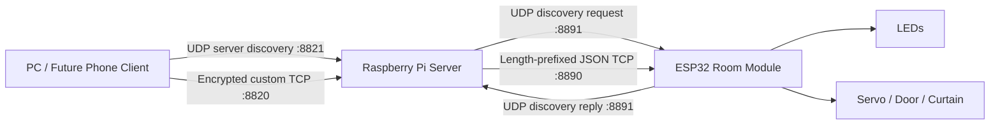

# Smart Home Control System

A Python client-server smart-home controller for a Raspberry Pi powered doll-house model. The server controls simulated devices today and is structured so Raspberry Pi GPIO device classes can be added later. Multiple GUI clients can connect at the same time over encrypted low-level TCP sockets.

## Features

- Pure Python object-oriented design
- Custom 10-byte length-prefixed TCP protocol
- RSA key exchange plus Fernet symmetric encryption
- Threaded server with multiple simultaneous clients
- JSON request and response payloads
- Login and role-based permissions
- Sign-up flow with hashed password storage
- Tkinter desktop GUI client
- Connection profiles plus UDP auto-discovery for finding the Raspberry Pi server
- JSON server/device settings for mock or GPIO mode
- ESP32/ESP8266 network device backend for wireless device modules
- Event-driven live device updates using `GET_UPDATES`
- Server log file support
- Mock LED strips, mini-fridge, fan, and sensor devices
- Unit tests for protocol, permissions, and device behavior

## Architecture



## Install

```bash
python -m venv .venv
.venv\Scripts\activate
pip install -r requirements.txt
```

On macOS/Linux, activate with:

```bash
source .venv/bin/activate
```

## Connect The Raspberry Pi And ESP32 To Wi-Fi

The Raspberry Pi, ESP32, and computer client should be connected to the same Wi-Fi network while testing locally. The ESP32 usually works best on a 2.4 GHz Wi-Fi network. If your router has separate 2.4 GHz and 5 GHz names, use the 2.4 GHz name for the ESP32.

### Apps To Install

Install these apps on your computer:

| Purpose | Recommended App |
| --- | --- |
| Prepare the Raspberry Pi SD card | Raspberry Pi Imager |
| Connect to the Raspberry Pi from Windows | PowerShell with `ssh` |
| Find the Raspberry Pi IP address | Router device list or Advanced IP Scanner |
| Program the ESP32 | Thonny |
| Make ESP32 USB port appear, if needed | CP210x or CH340 USB driver, depending on the ESP32 board |

### Connect The Raspberry Pi To Wi-Fi

1. Install and open **Raspberry Pi Imager**.
2. Choose the Raspberry Pi model and Raspberry Pi OS.
3. Click the settings/gear icon, or **Edit Settings**.
4. Set a username and password.
5. Add your Wi-Fi name and Wi-Fi password.
6. Enable **SSH**.
7. Write the image to the SD card.
8. Put the SD card into the Raspberry Pi and connect the Pi to power.
9. Wait about 1-2 minutes for the Pi to boot.
10. Find the Pi IP address using your router device list or **Advanced IP Scanner**.

From Windows PowerShell, connect to the Pi:

```powershell
ssh YOUR_PI_USERNAME@YOUR_PI_IP
```

Example:

```powershell
ssh mozes@192.168.1.209
```

If the connection works, the Pi is connected to Wi-Fi correctly.

### Install And Run The Server On The Pi

Copy the project to the Pi, then run:

```bash
cd ~/SmartHomeProject
python3 -m venv .venv
source .venv/bin/activate
pip install -r requirements.txt
python -m smart_home_project.server.main
```

For normal hardware use, the server should listen on all network interfaces:

```json
"host": "0.0.0.0"
```

To use ESP32 devices, set this in `smart_home_project/server/server_settings.json`:

```json
"device_mode": "esp",
"device_config": "esp_devices_config.example.json"
```

### Connect The ESP32 To Wi-Fi

1. Plug the ESP32 into the computer with a USB data cable.
2. Open **Thonny**.
3. In the bottom-right interpreter menu, choose **MicroPython (ESP32)** and select the ESP32 COM port.
4. If no ESP32 COM port appears, install the correct USB driver for the board, usually CP210x or CH340, then reconnect the ESP32.
5. Open `esp_examples/micropython_esp_room_server.py`.
6. Change these lines to your own Wi-Fi details:

```python
WIFI_SSID = "YOUR_WIFI_NAME"
WIFI_PASSWORD = "YOUR_WIFI_PASSWORD"
```

7. Check that the `DEVICES` dictionary uses the GPIO pins you actually connected.

Example:

```python
DEVICES = {
    "living_room_light": {
        "type": "led",
        "pin": 12,
        "active_low": False,
    }
}
```

8. Save the file to the ESP32 as:

```text
main.py
```

9. Press the red **Stop** button in Thonny.
10. Press `Ctrl+D` to reboot the ESP32.

Successful ESP32 output looks like this:

```text
Wi-Fi connected: ('192.168.1.224', '255.255.255.0', '192.168.1.1', ...)
ESP room server listening on 8890
ESP discovery waiting on UDP 8891
```

The first IP address is the ESP32 IP address.

### Test That The Pi Can Reach The ESP32

SSH into the Pi and run:

```bash
ping -c 4 ESP32_IP_ADDRESS
```

Example:

```bash
ping -c 4 192.168.1.224
```

If the ping works, the Pi and ESP32 are on the same network.

Then restart the Pi server:

```bash
sudo systemctl restart smart-home-server
sudo journalctl -u smart-home-server -n 50 --no-pager
```

The logs should show that the ESP32 was discovered or that commands are being sent to it.

### Common Problems

| Problem | Fix |
| --- | --- |
| ESP32 does not appear in Thonny | Use a USB data cable, install CP210x/CH340 driver, and reconnect the board. |
| ESP32 connects in Thonny but not after power restart | Make sure the file is saved on the ESP32 as `main.py`. |
| Pi cannot ping ESP32 | Check that both are on the same Wi-Fi network and that the ESP32 printed a valid IP address. |
| GUI connects to Pi but LED does not turn on | Test the GPIO pin in Thonny and make sure the pin number in `DEVICES` matches the physical wire. |
| Button works backwards | Change `active_low` between `True` and `False` in the ESP32 device config. |
| ESP32 IP changed | Use the ESP discovery system, or update `esp_host` in the ESP device config. |

## Run Locally

Start the server:

```bash
python -m smart_home_project.server.main --host 127.0.0.1 --port 8820
```

The server also reads defaults from `smart_home_project/server/server_settings.json`.

Start one or more GUI clients in separate terminals:

```bash
python -m smart_home_project.client.main
```

The GUI has a `Find Server` button and also searches automatically when it opens. This lets the PC find the Raspberry Pi after changing Wi-Fi networks, as long as the PC and Pi are on the same local network and UDP port `8821` is not blocked.

User data is stored in `smart_home_project/server/server_config.json`. This is the current secured local user database: passwords are saved as salted PBKDF2-SHA256 hashes, never as plaintext.

Default users are included:

| Username | Password | Role |
| --- | --- | --- |
| admin | admin123 | admin |
| parent | parent123 | parent |
| child | child123 | child |
| guest | guest123 | guest |

Passwords are stored as PBKDF2-SHA256 hashes with random salts, not as plaintext.

## Protocol

All frames use a fixed 10-byte ASCII length field followed by the payload bytes.

Example:

```text
payload: TURN_ON:LED_1
length: 13
frame: 0000000013TURN_ON:LED_1
```

The `Protocol` class creates messages, sends complete frames with `sendall`, and receives full frames with `recv_exact`. It handles partial receives, clean disconnects, mid-frame disconnects, invalid length fields, bytes, and UTF-8 text payloads.

After encryption is established, the payload inside each length-prefixed frame is an encrypted Fernet token containing JSON.

Example plaintext request before encryption:

```json
{
  "command": "TURN_ON",
  "device_id": "led_strip_1"
}
```

Example plaintext response before encryption:

```json
{
  "status": "ok",
  "message": "Command executed",
  "data": {
    "device_id": "led_strip_1",
    "state": "on"
  }
}
```

## Encryption

The handshake is implemented in `common/encryption.py`.

1. The server generates an RSA-2048 key pair at startup.
2. The server sends its public key to a new client using the length-prefixed protocol.
3. The client generates a Fernet symmetric key.
4. The client encrypts that symmetric key with the server public key using RSA-OAEP with SHA-256.
5. The server decrypts the symmetric key with its private key.
6. All later JSON messages are encrypted with Fernet and then sent through the custom protocol.

The project requires the `cryptography` package and intentionally does not fall back to fake encryption.

## Permissions

Permissions are role-based:

- `admin`: can control every device and action.
- `parent`: can control most devices, including fridge temperature.
- `child`: can control allowed lights and gadgets, not fridge temperature.
- `guest`: can only list devices and view status.

Permissions are checked before every device command. Permission denials are logged and returned as structured error responses.

## Commands

Supported commands:

- `LOGIN username password`
- `SIGN_UP username password role`
- `LIST_DEVICES`
- `GET_UPDATES since_revision timeout`
- `GET_STATUS device_id`
- `TURN_ON device_id`
- `TURN_OFF device_id`
- `SET_BRIGHTNESS device_id value`
- `SET_TEMPERATURE device_id value`
- `EXIT`

The GUI sends these commands as encrypted JSON messages.

## Tests

Run:

```bash
python -m unittest discover -s tests
```

## Adding Raspberry Pi GPIO Devices Later

Real hardware support can be added by subclassing `BaseDevice` in `server/devices.py`.

Recommended approach:

1. Create a class such as `GPIOLedStripDevice(BaseDevice)`.
2. Initialize GPIO pins in the constructor.
3. Override `perform_action` to call GPIO libraries such as `gpiozero` or `RPi.GPIO`.
4. Keep `to_dict` returning serializable state for clients.
5. Register the real device in `DeviceManager` instead of, or alongside, mock devices.

This keeps protocol, authentication, permissions, and GUI code unchanged while swapping the hardware backend.

See [HARDWARE.md](HARDWARE.md) and [RASPBERRY_PI_SETUP.md](RASPBERRY_PI_SETUP.md) before wiring devices.

For wireless ESP modules, see [ESP_SETUP.md](ESP_SETUP.md).

To copy Python server updates to the Pi and restart the service, run from PowerShell:

```powershell
.\update_pi_server.ps1
```
